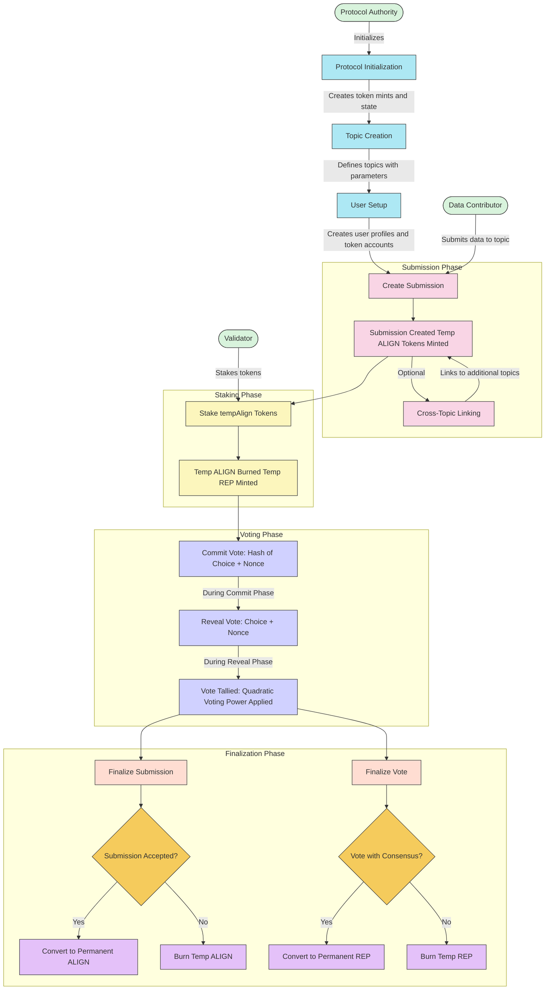

# Protocol Workflow Diagram

This diagram illustrates the complete workflow of the Alignment Protocol, from protocol initialization to submission finalization.

## Protocol Workflow Explanation

The Alignment Protocol workflow consists of the following key phases:

### 1. Protocol Initialization

- Protocol Authority initializes the protocol state
- Creates four token mints:
  - Temporary ALIGN token mint (for contributors)
  - Permanent ALIGN token mint
  - Temporary REP token mint (for validators)
  - Permanent REP token mint
- Sets up configuration parameters (e.g., tokens per submission)

### 2. Topic Creation

- Protocol Authority creates topics with specific parameters
- Each topic has dedicated commit and reveal phase durations
- Topics are uniquely identified and organize submissions by category

### 3. User Setup

- Contributors and Validators create user profiles
- Protocol establishes token accounts:
  - Protocol-owned temporary token accounts
  - User-owned permanent token accounts (ATAs)

### 4. Submission Phase

- Contributors submit data to topics
- Submission data is stored in on-chain PDAs
- Submission-topic links are created
- Contributors receive temporary ALIGN tokens (100 per submission)
- Optional: Cross-topic linking for multi-topic submissions

### 5. Staking Phase

- Validators stake temporary ALIGN tokens to participate in voting
- Staked temporary ALIGN is burned
- Temporary REP is minted in 1:1 ratio
- This REP represents voting power in the protocol

### 6. Voting Phase

- Two-phase voting system:
  - **Commit Phase**: Validators submit encrypted vote commitments
    - Hash of (vote choice + secret nonce)
    - Vote power locked based on tempREP tokens
  - **Reveal Phase**: Validators reveal actual vote choice with nonce
    - Vote power applied quadratically (sqrt of token amount)
    - Each validator's vote updates the submission's tallies

### 7. Finalization Phase

- **Submission Finalization**:

  - If accepted (more YES than NO votes):
    - Convert contributor's tempALIGN to permanent ALIGN
    - Send to contributor's personal ATA
  - If rejected:
    - Burn temporary tokens without replacement

- **Vote Finalization**:
  - If validator voted correctly (with majority):
    - Convert tempREP to permanent REP
    - Send to validator's personal ATA
  - If validator voted incorrectly:
    - Burn tempREP tokens without replacement

### Key Considerations

- Time-bound phases enforce structured participation
- Two-stage token lifecycle ensures accountability
- Quadratic voting prevents governance capture by large token holders
- Multiple topics allow cross-subject organization of data
