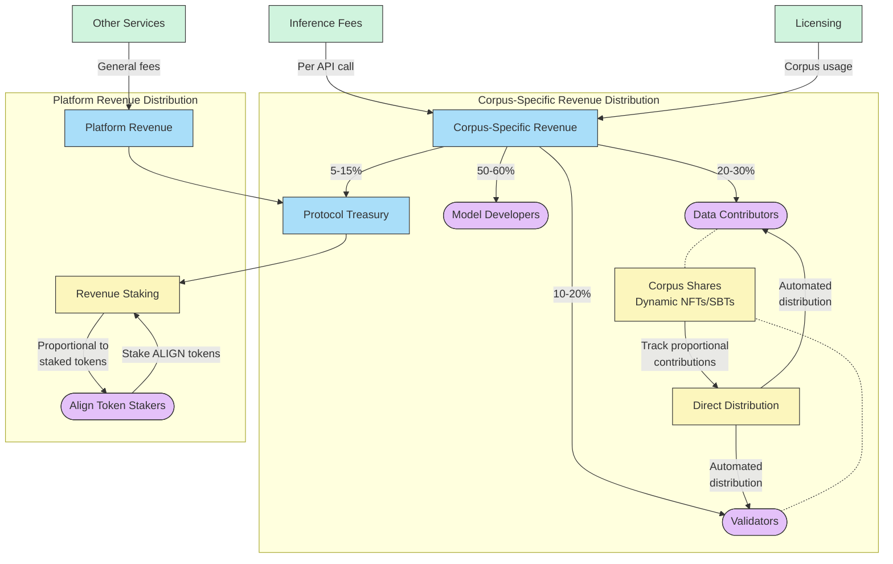

# Revenue Sharing & Distribution Diagram

This diagram illustrates how revenue is shared and distributed in the Alignment Protocol.



## Revenue Sharing Explanation

The Alignment Protocol employs a dual-layered revenue sharing model:

### 1. Corpus-Specific Revenue (Direct Revenue)

- **Sources**: Model inference fees, licensing fees for specific corpora
- **Distribution**:

  - 50-60% to Model Developers who deploy models using the corpus
  - 20-30% to Data Contributors who submitted validated data
  - 10-20% to Validators who ensured data quality
  - 5-15% to Protocol Treasury

- **Tracking Mechanism**: Dynamic NFTs/SBTs (Corpus Shares) record each participant's contribution proportionally
- **Example**: A model charges $0.01 per API call and receives 100,000 calls ($1,000 revenue)
  - Model developer: $600 (60%)
  - Data contributors: $200 (20%, distributed proportionally via corpus shares)
  - Validators: $150 (15%, distributed proportionally via corpus shares)
  - Protocol treasury: $50 (5%)

### 2. Platform Revenue (Indirect Revenue)

- **Sources**: Protocol-wide fees, treasury's share of corpus revenue
- **Distribution Method**: Revenue Staking mechanism

  - ALIGN token holders stake their tokens to earn passive returns
  - Revenue is distributed proportionally based on stake amount:
    ```
    User Revenue Share = (User's Staked ALIGN / Total Staked ALIGN) × Platform Revenue
    ```

- **Example**: If the platform treasury accumulates $10,000:
  - User staking 500 ALIGN tokens (out of 5,000 total staked) receives $1,000

### Key Implementation Features

- All distributions executed automatically via transparent smart contracts
- Clear distinction between economic incentives (Revenue Staking) and governance (Reputation tokens)
- Atomic-level tracking ensures accurate attribution across multiple corpora
