# Token Flow Diagram

This diagram illustrates how tokens move through the Alignment Protocol system.

```mermaid
flowchart LR
    %% Entities
    Contributor([Data Contributor])
    Validator([Validator])

    %% Initial Phase - Submission & Token Minting
    subgraph "1. Submission & Initial Tokens"
        A1[Submit Data to Topic]
        TempAlign[Temporary ALIGN]

        Contributor -->|Creates Submission| A1
        A1 -->|Mints 100| TempAlign
    end

    %% Connect phases
    TempAlign --> AcquireTokens

    %% Staking Phase
    subgraph "2. Staking"
        AcquireTokens[Validator Acquires Tokens]
        A2[Stake tempAlign]
        TempRep[Temporary REP]
        Burned1((Burned))

        AcquireTokens --> A2
        A2 -->|Burned| Burned1
        A2 -->|Minted 1:1| TempRep
    end

    %% Connect phases
    TempRep --> A3

    %% Voting Phase
    subgraph "3. Voting"
        A3[Vote on Submission]
        VotePower[Quadratic Voting Power]

        Validator -->|Controls| TempRep
        A3 -->|√tokens| VotePower
    end

    %% Connect phases
    VotePower --> FinalizeProcess

    %% Finalization Phase
    subgraph "4. Finalization"
        FinalizeProcess[End of Voting Period]

        %% Submission Finalization
        A4[Finalize Submission]
        AcceptPath{Submission Accepted?}

        %% Vote Finalization
        A5[Finalize Vote]
        CorrectPath{Voted with Majority?}

        %% Outcomes
        Burned2((Burned))
        PermanentAlign[Permanent ALIGN]
        PermanentRep[Permanent REP]

        FinalizeProcess --> A4
        FinalizeProcess --> A5

        %% Submission finalization flow
        A4 --> AcceptPath
        AcceptPath -->|Yes| PermanentAlign
        AcceptPath -->|No| Burned2

        %% Vote finalization flow
        A5 --> CorrectPath
        CorrectPath -->|Yes| PermanentRep
        CorrectPath -->|No| Burned2
    end

    %% Final ownership
    PermanentAlign -->|Transferred to| Contributor
    PermanentRep -->|Transferred to| Validator

    %% Styling
    classDef tempTokens fill:#f9d5e5,stroke:#333,stroke-width:1px
    classDef permTokens fill:#ade8f4,stroke:#333,stroke-width:1px
    classDef actions fill:#e2e2e2,stroke:#333,stroke-width:1px
    classDef entities fill:#d8f3dc,stroke:#333,stroke-width:1px
    classDef burned fill:#ff9999,stroke:#333,stroke-width:1px
    classDef decision fill:#f5cb5c,stroke:#333,stroke-width:1px
    classDef connector fill:#e2e2e2,stroke:#333,stroke-width:1px,stroke-dasharray: 5 5

    class TempAlign,TempRep tempTokens
    class PermanentAlign,PermanentRep permTokens
    class A1,A2,A3,A4,A5,VotePower,FinalizeProcess actions
    class AcquireTokens connector
    class Contributor,Validator entities
    class Burned1,Burned2 burned
    class AcceptPath,CorrectPath decision
```

## Token Flow Explanation

The diagram illustrates how tokens flow through the Alignment Protocol's lifecycle:

### 1. Submission & Initial Tokens

- Contributors create submissions by providing data to a topic
- Upon submission, 100 temporary ALIGN tokens (tempAlign) are minted
- These tokens represent the potential economic value of the contribution
- tempAlign can only be acquired by making submissions

### 2. Staking

- Anyone with tempAlign can stake these tempAlign tokens and earn temporary REP tokens to become a validator and participate in the validation process
- When staked, tempAlign tokens are burned and converted to tempRep at a 1:1 ratio
- tempRep represents validation rights and voting power

### 3. Voting

- Validators use their tempRep tokens to vote on submissions (YES/NO)
- Voting power scales quadratically (square root of tokens) to balance influence
- This prevents large token holders from having disproportionate control
- Voting occurs in two phases: commit (encrypted vote) and reveal (verification)

### 4. Finalization

After the voting period ends:

- **For Contributors**:

  - If submission is accepted (majority YES votes):
    - Remaining tempAlign tokens convert to permanent ALIGN
    - Transferred to contributor's personal wallet
  - If submission is rejected:
    - Temporary tokens are burned without replacement

- **For Validators**:
  - If they voted with the majority (correctly):
    - tempRep tokens convert to permanent REP
    - Transferred to validator's personal wallet
  - If they voted against the majority:
    - tempRep tokens are burned without replacement

### Token Outcomes

- **Permanent ALIGN tokens**: Represent validated contributions, can be used for governance and revenue sharing
- **Permanent REP tokens**: Represent validation expertise, enable participation in governance

This two-stage token lifecycle (temporary → permanent) creates accountability and incentivizes high-quality contributions and careful validation.
