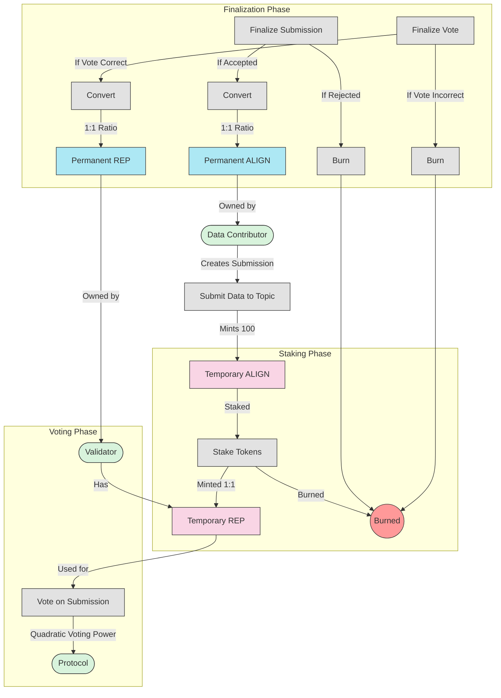

# Token Flow Diagram

This diagram illustrates how tokens move through the Alignment Protocol system.

## Token Flow Explanation

1. **Initial Token Issuance**:
   - Contributors receive Temporary ALIGN tokens (tempAlign) upon submitting data
   - 100 tempAlign tokens are minted per submission

2. **Staking Mechanism**:
   - Validators stake tempAlign tokens to receive Temporary REP tokens (tempRep)
   - tempAlign is burned during staking in a 1:1 conversion ratio
   - tempRep represents voting power in the validation process

3. **Voting Process**:
   - Validators use tempRep tokens to vote on submissions
   - Voting power scales quadratically (sqrt of tokens) to balance influence
   - Votes go through commit and reveal phases for honest participation

4. **Finalization Outcomes**:
   - For Contributors:
     - If submission is accepted: tempAlign tokens convert to permanent ALIGN
     - If submission is rejected: tempAlign tokens are burned
   - For Validators:
     - If they voted with consensus: tempRep tokens convert to permanent REP
     - If they voted against consensus: tempRep tokens are burned

5. **Permanent Tokens**:
   - Permanent ALIGN (for contributors) and REP (for validators) represent successfully validated participation
   - These tokens can be used for governance and revenue sharing